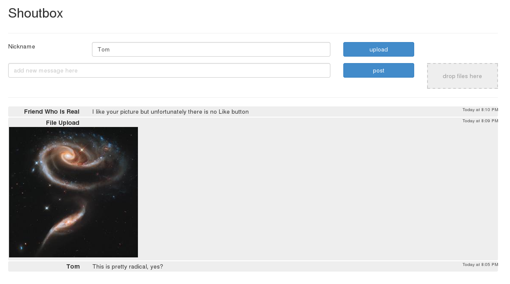

# A Shoutbox

A simple standalone MySQL/MariaDB-backed PHP shoutbox with image
uploads and no authentication.

Original by [@mbuchetics](https://github.com/mbuchetics), tweaked by
[@thombles](https://github.com/thombles/) for his own nefarious
purposes. Posts include sender name, the layout is different and it
all works on PHP 7.

## How to

1. Create database and run `database/create.sql` to setup tables
2. Copy/move `server/config.example.php` to `server/config.php` and
enter your database config
3. Run, e.g. `php -S 0.0.0.0:8080`, or copy into an Apache
VirtualHost, etc.

